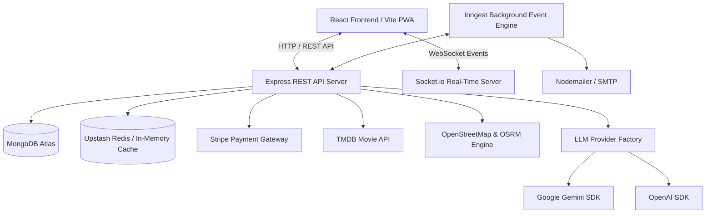
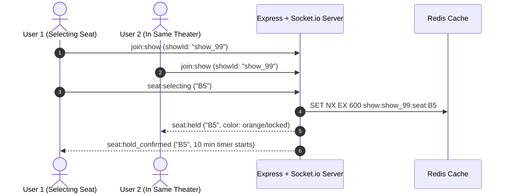

# 🎬 SHOWTIME — Complete Architecture & Codebase Master Encyclopedia

> **Welcome to the definitive architectural and engineering handbook for ShowTime.**  
> This comprehensive document leaves no stone unturned. Every module, folder, file, database model, Redis caching key, background queue, real-time WebSocket event, AI provider, and API endpoint is exhaustively documented with its purpose, inner mechanics, and exact data flow.

---

## 📑 TABLE OF CONTENTS
1. [Executive Summary & Technology Stack](#1-executive-summary--technology-stack)
2. [High-Level System Architecture & Data Flow](#2-high-level-system-architecture--data-flow)
3. [Backend Codebase Directory & File Encyclopedia](#3-backend-codebase-directory--file-encyclopedia)
   - [Root Files (`server.js`, `package.json`, etc.)](#31-backend-root-files)
   - [Configs Layer (`db.js`, `redis.js`, `socket.js`, `nodeMailer.js`, `swagger.js`)](#32-configs-layer)
   - [Models Layer (Mongoose Schemas)](#33-models-layer)
   - [Controllers Layer (All 10 Controllers)](#34-controllers-layer)
   - [Routes Layer](#35-routes-layer)
   - [AI Engine Layer (`services/ai/`)](#36-ai-engine-layer)
   - [Middleware & Inngest Background Cron Workflows](#37-middleware--inngest-workflows)
4. [Frontend Codebase Directory & File Encyclopedia](#4-frontend-codebase-directory--file-encyclopedia)
   - [Context & State Management (`AppContext.jsx`)](#41-context--state-management)
   - [All User-Facing Pages & Routing](#42-user-facing-pages)
   - [All Admin Control Center Pages](#43-admin-control-center-pages)
   - [Components Library](#44-components-library)
   - [ShowTime AI ChatBot Widget & Animations](#45-showtime-ai-chatbot-widget--animations)
5. [In-Memory Redis Architecture & 10-Minute Seat Locking](#5-in-memory-redis-architecture--seat-locking)
6. [Real-Time Socket.io Lifecycle](#6-real-time-socketio-lifecycle)
7. [Complete REST API Catalog](#7-complete-rest-api-catalog)
8. [Environment Variables Reference](#8-environment-variables-reference)
9. [Deployment, Production Build & Vercel / OAuth Guide](#9-deployment-production-build--oauth-guide)

---

## 1. EXECUTIVE SUMMARY & TECHNOLOGY STACK

**ShowTime** is an enterprise-grade, real-time movie ticket booking and cinematic discovery platform. It combines high-throughput seat locking, interactive theater mapping with live GPS routing, Stripe payment processing, Redis caching, Inngest background event processing, and a multi-provider LLM AI Concierge (**ShowTime AI**).

### Technology Matrix:
- **Frontend**: React 19 (Vite 6), Tailwind CSS v4, Lucide Icons, Axios, React Router DOM v7, React Hot Toast, `@react-oauth/google`.
- **Backend**: Node.js (v20+), Express.js 4, Socket.io 4, Mongoose 8 (MongoDB Atlas), `@upstash/redis` / `ioredis`, Inngest SDK, Stripe SDK, Nodemailer.
- **AI & LLM Providers**: Google Gemini API (`@google/genai`), OpenAI API (`openai`), Custom Dynamic Model Discovery Engine.
- **External APIs**: TMDB (The Movie Database) API, OpenStreetMap Nominatim Geospatial Search & OSRM Routing Engine.

---

## 2. HIGH-LEVEL SYSTEM ARCHITECTURE & DATA FLOW



### Core Architecture Highlights:
1. **Zero Overbooking via Distributed Redis Locking**: When a user selects a seat, Redis locks that seat key (`show:<id>:seat:<number>`) with a strict **10-minute TTL (Time-To-Live)**. Socket.io broadcasts `seat:held` in real-time to all clients in that theater room, disabling that seat for everyone else.
2. **Multi-Model Dynamic AI Concierge**: Built on an Object-Oriented Provider pattern (`BaseLLMProvider` $\rightarrow$ `GeminiProvider` / `OpenAIProvider`), managed in real-time through an Admin AI Control Center (`/admin/ai-settings`) with dynamic MongoDB model cards and live API discovery.
3. **Location-Aware Geospatial Theater Engine**: Finds real physical cinemas in any Indian city via OpenStreetMap Nominatim, caches queries in Redis for 24 hours, and calculates live turn-by-turn driving directions with interactive OSRM routing.

---

## 3. BACKEND CODEBASE DIRECTORY & FILE ENCYCLOPEDIA

### 3.1 Backend Root Files
- [`backend/server.js`](file:///c:/Users/rgyan/OneDrive/Desktop/movieticket/backend/server.js): The central entry point. Initializes Express, sets up CORS for `http://localhost:5173`, `http://localhost:5174`, and production Vercel domains, binds Socket.io with HTTP server, registers all 9 route modules, mounts Stripe raw webhook listeners, and connects MongoDB.
- [`backend/.env`](file:///c:/Users/rgyan/OneDrive/Desktop/movieticket/backend/.env): Holds sensitive credentials: `MONGODB_URI`, `JWT_SECRET`, `UPSTASH_REDIS_REST_URL`, `UPSTASH_REDIS_REST_TOKEN`, `STRIPE_SECRET_KEY`, `STRIPE_WEBHOOK_SECRET`, `TMDB_API_KEY`, `GEMINI_API_KEY`, `OPENAI_API_KEY`, `SMTP_USER`, `SMTP_PASS`.

---

### 3.2 Configs Layer (`backend/configs/`)
- [`db.js`](file:///c:/Users/rgyan/OneDrive/Desktop/movieticket/backend/configs/db.js): Connects Mongoose to MongoDB Atlas with connection pooling and error logging.
- [`redis.js`](file:///c:/Users/rgyan/OneDrive/Desktop/movieticket/backend/configs/redis.js): Initializes the Upstash Redis HTTP client (`@upstash/redis`) or fallback client. Exposes atomic commands `get`, `set`, `del`, `setex`, `keys`, `expire`, and `scan`.
- [`socket.js`](file:///c:/Users/rgyan/OneDrive/Desktop/movieticket/backend/configs/socket.js): Sets up Socket.io server with room-based namespaces (`join:show`, `leave:show`). Handles real-time events: `seat:selecting`, `seat:released`, and room disconnect cleanup.
- [`nodeMailer.js`](file:///c:/Users/rgyan/OneDrive/Desktop/movieticket/backend/configs/nodeMailer.js): Configures Nodemailer SMTP transport with HTML email templates for OTP verification, booking confirmations with QR codes, and reminder alerts.
- [`swagger.js`](file:///c:/Users/rgyan/OneDrive/Desktop/movieticket/backend/configs/swagger.js): Generates interactive OpenAPI 3.0 / Swagger UI documentation at `/api/docs`.

---

### 3.3 Models Layer (`backend/models/`)

#### 1. [`User.js`](file:///c:/Users/rgyan/OneDrive/Desktop/movieticket/backend/models/User.js)
Stores user accounts, OAuth identities, and preferences.
- `name` *(String)*: User full name.
- `email` *(String, Unique)*: Email address.
- `password` *(String, Hashed with bcrypt)*: Optional for Google OAuth users.
- `googleId` *(String)*: Google OAuth sub identifier.
- `role` *(String: `'user'` | `'admin'`)*: Access control tier.
- `favorites` *(Array of Movie IDs)*: User's saved watchlist.
- `city` *(String)*: Default detected/selected city.

#### 2. [`movieModel.js`](file:///c:/Users/rgyan/OneDrive/Desktop/movieticket/backend/models/movieModel.js)
Stores movie catalog synchronized from TMDB or created by Admin.
- `title`, `overview`, `poster_path`, `backdrop_path`, `release_date`, `genres`, `runtime`, `vote_average`, `trailer_url`, `language`, `cast`, `director`.

#### 3. [`showModel.js`](file:///c:/Users/rgyan/OneDrive/Desktop/movieticket/backend/models/showModel.js)
Represents a specific theatrical screening slot.
- `movieId` *(ObjectId ref `Movie`)*.
- `theatre` *(Object)*: Name, city, screen number, experience format (`IMAX 3D`, `Dolby Atmos`, `4DX`, `VIP Recliner`).
- `showDateTime` *(Date)*: Screening start date and time.
- `ticketPrice` *(Number)*: Base seat price.
- `seats` *(Array of Seat objects)*: `{ seatNumber: 'A1', type: 'VIP'|'Premium'|'Standard', price: 250, isBooked: false, bookedBy: null }`.

#### 4. [`bookingModel.js`](file:///c:/Users/rgyan/OneDrive/Desktop/movieticket/backend/models/bookingModel.js)
Stores confirmed ticket purchases.
- `userId` *(ObjectId ref `User`)*, `showId` *(ObjectId ref `Show`)*, `movieId` *(ObjectId ref `Movie`)*.
- `seats` *(Array of String)*: e.g. `['B5', 'B6']`.
- `totalAmount` *(Number)*, `paymentStatus` *(String: `'pending'` | `'paid'` | `'refunded'`)*.
- `stripeSessionId` *(String)*, `qrCodeUrl` *(String)*, `bookingDate` *(Date)*.

#### 5. [`AIConfig.js`](file:///c:/Users/rgyan/OneDrive/Desktop/movieticket/backend/models/AIConfig.js)
Stores live AI configuration, active provider, model cards, and parameters.
- `activeProvider` *(String: `'gemini'` | `'openai'`)*.
- `activeModel` *(String: e.g. `'gemini-3.6-flash'`)*.
- `temperature` *(Number: `0.0` to `1.0`)*.
- `maxTokens` *(Number: `512` to `4096`)*.
- `welcomeMessage` *(String)*.
- `suggestedPrompts` *(Array of Strings)*.
- `providerModelCards` *(Map/Object storing custom user-defined and discovered model cards)*.

#### 6. [`MovieReminder.js`](file:///c:/Users/rgyan/OneDrive/Desktop/movieticket/backend/models/MovieReminder.js)
Tracks user notification requests on upcoming releases.

#### 7. [`Otp.js`](file:///c:/Users/rgyan/OneDrive/Desktop/movieticket/backend/models/Otp.js)
Stores 6-digit email verification codes with a 5-minute MongoDB TTL index.

#### 8. [`reviewModel.js`](file:///c:/Users/rgyan/OneDrive/Desktop/movieticket/backend/models/reviewModel.js)
User movie ratings, written reviews, and likes.

---

### 3.4 Controllers Layer (`backend/controllers/`)

- [`authController.js`](file:///c:/Users/rgyan/OneDrive/Desktop/movieticket/backend/controllers/authController.js): Handles user registration, bcrypt password hashing, login, JWT token signing, OTP generation/verification, and Google OAuth ID Token verification.
- [`chatbotController.js`](file:///c:/Users/rgyan/OneDrive/Desktop/movieticket/backend/controllers/chatbotController.js): Orchestrates ShowTime AI. Loads config from `AIConfig.js`, instantiates the selected provider via `LLMProviderFactory`, executes multi-turn tool loops, and returns text + cards (`movies`, `shows`, `theaters`). Also provides `/api/chatbot/config` and `/api/chatbot/models/discover` for discovering live API models.
- [`bookingController.js`](file:///c:/Users/rgyan/OneDrive/Desktop/movieticket/backend/controllers/bookingController.js): Implements atomic seat selection, Redis 10-minute hold validation, Stripe Checkout Session creation, booking confirmation, and user ticket retrieval.
- [`showController.js`](file:///c:/Users/rgyan/OneDrive/Desktop/movieticket/backend/controllers/showController.js): Handles show creation, seat layout generation, date filtering (`/api/shows/movie/:movieId?date=YYYY-MM-DD`), and real-time seat status aggregation.
- [`tmdbController.js`](file:///c:/Users/rgyan/OneDrive/Desktop/movieticket/backend/controllers/tmdbController.js): Connects to TMDB API with Redis caching for `cache:now_playing_movies`, `cache:tmdb_upcoming`, and `cache:movie_details:<id>`.
- [`adminController.js`](file:///c:/Users/rgyan/OneDrive/Desktop/movieticket/backend/controllers/adminController.js): Aggregates dashboard analytics: total gross revenue, ticket count, top-performing theaters, occupancy rates, and show listings.
- [`recommendationController.js`](file:///c:/Users/rgyan/OneDrive/Desktop/movieticket/backend/controllers/recommendationController.js): Calculates personalized movie recommendations based on user favorites and genre matching.
- [`reviewController.js`](file:///c:/Users/rgyan/OneDrive/Desktop/movieticket/backend/controllers/reviewController.js): Handles CRUD for movie reviews, star ratings, and community feedback.
- [`stripeWebhooks.js`](file:///c:/Users/rgyan/OneDrive/Desktop/movieticket/backend/controllers/stripeWebhooks.js): Handles `checkout.session.completed` events from Stripe. Marks booking as `paid`, persists seat assignments in MongoDB, releases temporary Redis locks, and triggers email confirmation.
- [`userController.js`](file:///c:/Users/rgyan/OneDrive/Desktop/movieticket/backend/controllers/userController.js): Updates profile, toggle favorite movies, and city preferences.

---

### 3.5 Routes Layer (`backend/routes/`)
- `authRoutes.js` $\rightarrow$ `/api/auth/*`
- `chatbotRoutes.js` $\rightarrow$ `/api/chatbot/*`
- `bookingRoutes.js` $\rightarrow$ `/api/bookings/*`
- `showRoutes.js` $\rightarrow$ `/api/shows/*`
- `tmdbRoutes.js` $\rightarrow$ `/api/tmdb/*`
- `adminRoutes.js` $\rightarrow$ `/api/admin/*`
- `recommendationRoutes.js` $\rightarrow$ `/api/recommendations/*`
- `reviewRoutes.js` $\rightarrow$ `/api/reviews/*`
- `userRoutes.js` $\rightarrow$ `/api/users/*`

---

### 3.6 AI Engine Layer (`backend/services/ai/`)

ShowTime uses a decoupled, Object-Oriented LLM architecture:

```
                  BaseLLMProvider (Abstract)
                     ▲               ▲
                     │               │
        GeminiProvider               OpenAIProvider
```

1. [`BaseLLMProvider.js`](file:///c:/Users/rgyan/OneDrive/Desktop/movieticket/backend/services/ai/BaseLLMProvider.js): Base abstract class enforcing `generateReply({ messages, context, tools })` and `testConnection(apiKey, model)`.
2. [`GeminiProvider.js`](file:///c:/Users/rgyan/OneDrive/Desktop/movieticket/backend/services/ai/GeminiProvider.js): Full Google Gemini SDK integration (`@google/genai`). Translates JSON schemas into Gemini function declarations, executes tool calling loops up to 5 turns, deduplicates movie/theater cards, and cleans up thought preambles.
3. [`OpenAIProvider.js`](file:///c:/Users/rgyan/OneDrive/Desktop/movieticket/backend/services/ai/OpenAIProvider.js): OpenAI Chat Completions SDK implementation supporting function tools (`tools: [...]`).
4. [`LLMProviderFactory.js`](file:///c:/Users/rgyan/OneDrive/Desktop/movieticket/backend/services/ai/LLMProviderFactory.js): Factory that instantiates the active provider based on database settings and API keys.
5. [`chatbotTools.js`](file:///c:/Users/rgyan/OneDrive/Desktop/movieticket/backend/services/ai/chatbotTools.js):
   - **`getNowShowingMovies`**: Fetches movies with active shows in MongoDB.
   - **`getUpcomingMovies`**: Fetches upcoming releases cached in Redis (`cache:tmdb_upcoming`).
   - **`getAvailableShows`**: Searches live shows by movie and city.
   - **`getPlatformInfo`**: Returns verified knowledge about 10-minute seat hold, Stripe payment, and VIP recliners.
   - **`getNearbyTheaters`**: Queries OpenStreetMap Nominatim for physical cinemas in the requested city and caches results in Redis for 24h.

---

### 3.7 Inngest Background Cron Workflows (`backend/inngest/index.js`)
- **`releaseExpiredSeatHolds`**: Runs every 2 minutes. Scans Redis for expired seat hold keys and frees them up.
- **`sendMovieReleaseAlerts`**: Runs daily at 09:00 AM. Checks upcoming movies released today and emails all users who registered reminders in `MovieReminder`.

---

## 4. FRONTEND CODEBASE DIRECTORY & FILE ENCYCLOPEDIA

### 4.1 Context & State Management (`frontend/src/context/AppContext.jsx`)
Exposes global state across the entire application:
- `user`: Authenticated user profile and role (`'user'` or `'admin'`).
- `selectedCity`: Currently selected city object (`{ name: 'Bengaluru', lat, lon }`).
- `favoriteMovies`: List of favorite movie IDs for the logged-in user.
- `authModalOpen`: Boolean controlling login/signup modal popup.
- `currency`: Default currency symbol (`₹`).

---

### 4.2 All User-Facing Pages (`frontend/src/Pages/`)

1. [`Home.jsx`](file:///c:/Users/rgyan/OneDrive/Desktop/movieticket/frontend/src/Pages/Home.jsx): The landing hub. Features `HeroSection` with trailer banner, `movieSlider` for Now Showing releases, `DistrictCategoryBar`, `TrailerSection`, `VIPExperience`, and `FeatureSection`.
2. [`Movies.jsx`](file:///c:/Users/rgyan/OneDrive/Desktop/movieticket/frontend/src/Pages/Movies.jsx): Catalog page with search, genre filters (Action, Comedy, Drama, Sci-Fi), language filters, sorting, and pagination.
3. [`MovieDetails.jsx`](file:///c:/Users/rgyan/OneDrive/Desktop/movieticket/frontend/src/Pages/MovieDetails.jsx): Movie overview page with runtime, cast, director, high-definition trailer modal, user reviews, star ratings, and "Book Tickets" CTA.
4. [`SeatLayout.jsx`](file:///c:/Users/rgyan/OneDrive/Desktop/movieticket/frontend/src/Pages/SeatLayout.jsx):
   - **Movie Info Header**: Displays poster, title, runtime, genres, and selected date.
   - **Interactive 7-Day Date Switcher Bar**: Allows switching screening dates directly without leaving the seat layout page.
   - **Interactive Grid**: Visualizes VIP Recliners, Premium, and Standard seats.
   - **Live 10-Minute Hold Timer**: Displays dynamic countdown (`SeatHoldTimer.jsx`).
   - **Stripe Checkout**: Direct button to launch secure checkout.
5. [`Theaters.jsx`](file:///c:/Users/rgyan/OneDrive/Desktop/movieticket/frontend/src/Pages/Theaters.jsx): Shows cinema halls with address, amenities, and interactive **"Get Live Directions"** modal with GPS tracking.
6. [`Releases.jsx`](file:///c:/Users/rgyan/OneDrive/Desktop/movieticket/frontend/src/Pages/Releases.jsx): Displays upcoming TMDB movies, countdown to release, trailer previews, and email notification buttons.
7. [`MyBooking.jsx`](file:///c:/Users/rgyan/OneDrive/Desktop/movieticket/frontend/src/Pages/MyBooking.jsx): Shows user's past and upcoming booked tickets with scannable QR codes and PDF download options.
8. [`Favroites.jsx`](file:///c:/Users/rgyan/OneDrive/Desktop/movieticket/frontend/src/Pages/Favroites.jsx): Displays the user's personal movie watchlist.

---

### 4.3 All Admin Control Center Pages (`frontend/src/Pages/Admin/`)

1. [`Dashboard.jsx`](file:///c:/Users/rgyan/OneDrive/Desktop/movieticket/frontend/src/Pages/Admin/Dashboard.jsx): Visual analytics dashboard displaying total revenue, total tickets sold, occupancy rate charts, and recent transactions.
2. [`AddShow.jsx`](file:///c:/Users/rgyan/OneDrive/Desktop/movieticket/frontend/src/Pages/Admin/AddShow.jsx): Form to schedule new movie screenings by selecting a movie, theater, format (IMAX/Dolby), pricing, and date/time.
3. [`ListShow.jsx`](file:///c:/Users/rgyan/OneDrive/Desktop/movieticket/frontend/src/Pages/Admin/ListShow.jsx): View and delete scheduled shows.
4. [`ListBooking.jsx`](file:///c:/Users/rgyan/OneDrive/Desktop/movieticket/frontend/src/Pages/Admin/ListBooking.jsx): Master table of all customer bookings with payment statuses and seat numbers.
5. [`AISettings.jsx`](file:///c:/Users/rgyan/OneDrive/Desktop/movieticket/frontend/src/Pages/Admin/AISettings.jsx):
   - **Provider Switching**: Toggle between Google Gemini and OpenAI with 1-click.
   - **Live Model Discovery**: Query live provider APIs in real-time to discover newly released models.
   - **Persistent Custom Model Deck**: Add and save custom model cards stored directly in MongoDB (`AIConfig.js`).
   - **Live Connectivity Test**: Test model response time and token latency directly from the browser.
   - **Hyperparameter Controls**: Sliders for Temperature (`0.0 - 1.0`) and Max Output Tokens (`512 - 4096`).

---

### 4.4 Components Library (`frontend/src/Components/`)
- `NavBar.jsx`: Header with city selector dropdown, search bar, navigation links, and User Profile menu.
- `Footer.jsx`: Platform links, copyright, and social badges.
- `AuthModal.jsx`: Modal for Email/Password login, OTP registration, and Google OAuth 2.0 Sign-In.
- `TrailerModal.jsx`: Video player modal embedding official YouTube trailers.
- `LiveRouteTrackerModal.jsx`: Interactive map modal calculating turn-by-turn routing to theaters.
- `SeatHoldTimer.jsx`: Floating warning badge displaying the remaining time on the user's 10-minute seat lock.

---

### 4.5 ShowTime AI ChatBot Widget & Animations (`ChatBotWidget.jsx`)

Located at [`frontend/src/Components/ChatBot/ChatBotWidget.jsx`](file:///c:/Users/rgyan/OneDrive/Desktop/movieticket/frontend/src/Components/ChatBot/ChatBotWidget.jsx):
- **White-Labeled Branding**: Styled strictly as **ShowTime AI Concierge ("CineBot")**.
- **0ms Prompt-Aware Dynamic Loading Ticker**: Instant client-side intent analyzer that detects user keywords (*theaters*, *action*, *seat hold*, *upcoming*, *bookings*) and cycles 4 personalized steps every 1.3 seconds.
- **Cinematic Shimmer Skeleton Cards**: Translucent glowing placeholder cards (`animate-shimmer`) with a light sweep gradient.
- **Dancing Soundwave Equalizer**: 4-bar dynamic audio equalizer inside the thinking badge.
- **60 FPS Character-by-Character Typewriter Stream**: Smoothly streams text with a glowing cursor `▌` before rendering rich interactive movie cards and showtime booking buttons.

---

## 5. IN-MEMORY REDIS ARCHITECTURE & SEAT LOCKING

ShowTime uses Redis for both high-speed caching and distributed seat concurrency:

```
┌─────────────────────────────────────────────────────────────┐
│                       REDIS KEYMAP                          │
├──────────────────────────┬──────────┬───────────────────────┤
│ Key Pattern              │ TTL      │ Description           │
├──────────────────────────┼──────────┼───────────────────────┤
│ show:<id>:seat:<number>  │ 10 Mins  │ Temporary seat hold   │
│ cache:now_playing_movies │ 1 Hour   │ Cached TMDB movies    │
│ cache:tmdb_upcoming      │ 6 Hours  │ Upcoming releases     │
│ cache:theaters:<city>    │ 24 Hours │ OpenStreetMap theaters│
│ cache:movie_details:<id> │ 12 Hours │ TMDB Movie detail info│
└──────────────────────────┴──────────┴───────────────────────┘
```

### 10-Minute Seat Locking Protocol:
1. User clicks seat `C4` in show `67b...`.
2. Frontend sends `POST /api/bookings/hold-seat` with `{ showId, seatNumber: 'C4' }`.
3. Backend runs `SET NX EX 600` on key `show:67b...:seat:C4` with `userId`.
4. If key exists, request is rejected (*"Seat already selected by another user"*).
5. If key is successfully set, Socket.io broadcasts `seat:held` to all connected users.
6. When payment succeeds on Stripe, key is converted to permanent MongoDB booking. If user abandons cart, key expires automatically in 10 minutes.

---

## 6. REAL-TIME SOCKET.IO LIFECYCLE



---

## 7. COMPLETE REST API CATALOG

| Method | Endpoint | Description | Auth Required |
| :--- | :--- | :--- | :--- |
| **POST** | `/api/auth/register` | Register new account & send OTP | No |
| **POST** | `/api/auth/verify-otp` | Verify OTP and issue JWT token | No |
| **POST** | `/api/auth/login` | Email/Password login | No |
| **POST** | `/api/auth/google` | Google OAuth token verification & login | No |
| **POST** | `/api/chatbot/message` | Send message to ShowTime AI Concierge | Optional |
| **GET** | `/api/chatbot/config` | Get AI settings, active model, and prompts | No |
| **POST** | `/api/chatbot/config` | Update AI active provider & hyperparameters | Admin |
| **GET** | `/api/chatbot/models/discover` | Query live Gemini / OpenAI API for models | Admin |
| **GET** | `/api/shows/movie/:movieId` | Get available shows filtered by date | No |
| **POST** | `/api/shows/create` | Create new show screening | Admin |
| **POST** | `/api/bookings/create-checkout-session` | Initialize Stripe checkout session | Yes |
| **GET** | `/api/bookings/my-bookings` | Retrieve user's confirmed tickets | Yes |
| **GET** | `/api/admin/dashboard` | Retrieve revenue and occupancy stats | Admin |
| **GET** | `/api/tmdb/now-playing` | Get cached now playing movies | No |
| **GET** | `/api/tmdb/upcoming` | Get upcoming movies from Redis | No |

---

## 8. ENVIRONMENT VARIABLES REFERENCE

### Backend (`backend/.env`):
```env
PORT=3001
MONGODB_URI=mongodb+srv://<username>:<password>@cluster.mongodb.net/movieticket
JWT_SECRET=your_jwt_secret_key
UPSTASH_REDIS_REST_URL=https://<your-upstash-url>.upstash.io
UPSTASH_REDIS_REST_TOKEN=your_upstash_token
STRIPE_SECRET_KEY=sk_test_...
STRIPE_WEBHOOK_SECRET=whsec_...
TMDB_API_KEY=your_tmdb_api_key
GEMINI_API_KEY=AIzaSy...
OPENAI_API_KEY=sk-proj-...
SMTP_USER=your_email@gmail.com
SMTP_PASS=your_email_app_password
```

### Frontend (`frontend/.env`):
```env
VITE_BASE_URL=http://localhost:3001
VITE_GOOGLE_CLIENT_ID=your_google_client_id.apps.googleusercontent.com
VITE_CURRENCY=₹
```

---

## 9. DEPLOYMENT, PRODUCTION BUILD & OAUTH GUIDE

### 🛠️ Production Build & Verification:
```bash
# Frontend build
cd frontend
npm run build

# Backend startup
cd backend
npm start
```

### 🌐 Google OAuth Configuration on Deployed Domain:
1. Go to **Google Cloud Console** $\rightarrow$ **Credentials** $\rightarrow$ Click Web Client.
2. Under **Authorized JavaScript Origins**, add:
   - `http://localhost:5173`
   - `http://localhost:5174`
   - `https://itsshowtimecom.vercel.app`
3. Under **Authorized Redirect URIs**, add:
   - `https://itsshowtimecom.vercel.app`
4. Set `VITE_GOOGLE_CLIENT_ID` in Vercel Dashboard Settings $\rightarrow$ Environment Variables, and trigger a Redeploy.

---

### 📦 Clean Project Archive Creation:
To package the entire project into a clean zip without `node_modules` or `.gitignore` files:
```bash
git archive --format=zip --output=project.zip HEAD
```

---
*Created with ❤️ for ShowTime Movie Ticket Booking Platform.*
